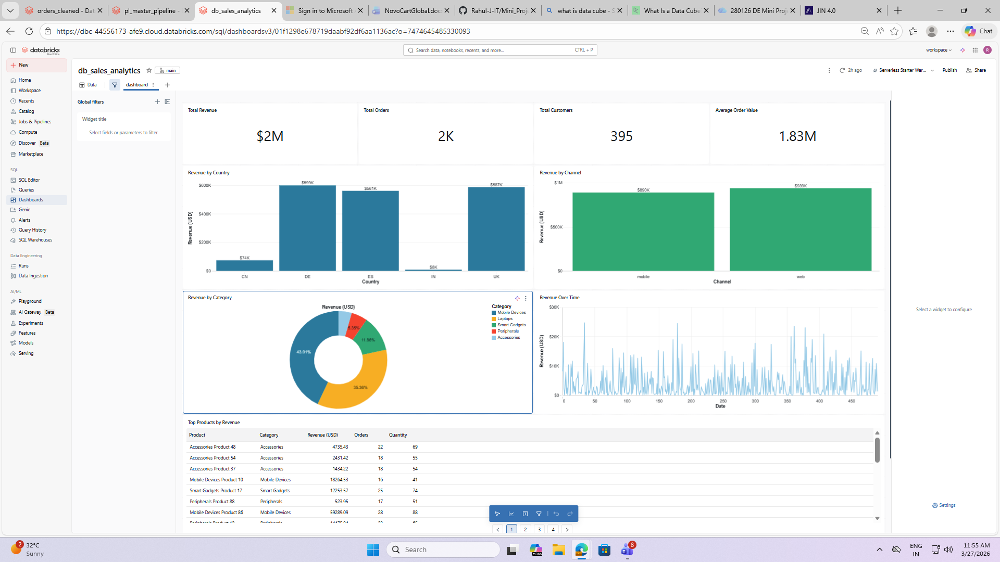

# Project Documentation

## Overview
This project implements a data pipeline using the medallion architecture (Bronze, Silver, Gold) for efficient data ingestion, transformation, and analytics. The pipeline is designed to support dashboarding and reporting.

---

## Table of Contents

1. Data Ingestion
2. Bronze Layer
3. Silver Layer
4. Gold Layer
5. Pipeline Orchestration
6. Dashboard
7. Optmization

---

## 1. Data Ingestion

- **Source**: Data ingested using fivetran from data lake of azure.
- **Tools Used**: Databricks notebooks, PySpark.
- **Process**:
  - Read raw data.
  - Store in Bronze layer.

---

## 2. Bronze Layer

- **Purpose**: Store raw, unprocessed data.
- **Actions**:
  - Minimal transformations.
  - Data stored in Delta Lake format.

---

## 3. Silver Layer

- **Purpose**: Cleaned and enriched data.
- **Actions**:
  - Data cleansing (null handling, type casting).
  - Deduplication and basic enrichment.
  - Store in Delta Lake.

---

## 4. Gold Layer

- **Purpose**: Aggregated, business-ready data.
- **Actions**:
  - Advanced transformations (aggregations, joins).
  - Store in Delta Lake.
- **KPI'S**:
  - Created Kpi's and data cube for analytics.
---

## 5. Pipeline Orchestration

- **Tools Used**: Databricks jobs, notebook chaining.
- **Steps**:
  1. Ingest data to Bronze.
  2. Transform to Silver.
  3. Aggregate to Gold.
  4. Schedules & Triggers At 04:00 AM every day.

---

## 6. Dashboard

- **Tools Used**: Databricks Dashboards
- **Features**:
  - Visualize Gold layer metrics.
- **KPIs**: Custom metrics as per business requirements.

---

## 7. Optmization

- **Tools Used**: notebooks
- **Methods**: 
  - OPTIMIZE
  - ZORDER
